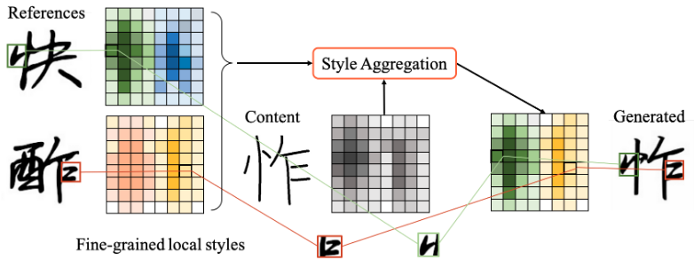

# FsFont: Few-Shot Font Generation by Learning Fine-Grained Local Styles (CVPR2022)
  
This is the official paddlepaddle implementation for "FsFont: Few-Shot Font Generation by Learning Fine-Grained Local Styles" by Licheng Tang, Yiyang Cai, Jiaming Liu, Zhibin Hong, Mingming Gong, Minhu Fan, Junyu Han, Jingtuo Liu, Errui Ding and Jingdong Wang.  
Paper Link: [arxiv](https://arxiv.org/abs/2205.09965) | [Bibtex](#1)


# Dependencies
>PaddlePaddle == 2.3.2  
>torch >= 1.10.0 (for grid plot)  
>torchvision >= 0.11.0  (for grid plot)  
>sconf >= 0.2.3  
>lmdb >= 1.2.1  


# How to start
## Data Preparation
### 1. Images & Characters  
Draw all font images first including training fonts, validation fonts and your own content font. Organize directories structure as below  
> Font Directory  
> |&#8195;&#8195;--| font1  
> |&#8195;&#8195;--| font2  
> |&#8195;&#8195;&#8195;&#8195; --| ch1.png  
> |&#8195;&#8195;&#8195;&#8195; --| ch2.png  
> |&#8195;&#8195;&#8195;&#8195; --| ...     
> |&#8195;&#8195;--| ...  

You also need to split all characters into train characters and val characters with unicode format and save them into json files, you can convert the utf8 format to unicode by using `hex(ord(ch))[2:].upper()`:  
> train_unis: \["4E00", "4E01", ...]  
> val_unis: \['8E21', ...]

### 2. Content-Reference mapping  
It is a dict you have to create by yourself before start, you can find the full CR-mapping algorithm in `appendix` and using the decompose dictionary of [LFFont](https://github.com/clovaai/lffont/blob/master/meta/chn_decompose.json). Elements in dict also need to be converted into unicode format. Please assure keys of CR mapping contain both of `train_unis` and `val_unis`.     
> {content1: \[ref1, ref2, ref3, ...],&#8195;content2: \[ref1, ref2, ref3, ...],&#8195;...}  

example(in utf-8 format):  
> {连: \[转, 还],&#8195;剧: \[呢, 别, 卖],&#8195;愫: \[累, 快, 请],&#8195; ...}  

**PS: You have to make sure the number of refereces of all contents be same for purpose of batch training.**   
`e.g. 连: [转, 转, 还] `

### 3. Run scripts  
``` 
python3 ./build_dataset/build_meta4train.py 
--saving_dir ./results/your_task_name/ 
--content_font path\to\content 
--train_font_dir path\to\training_font 
--val_font_dir path\to\validation_font 
--seen_unis_file path\to\train_unis.json 
--unseen_unis_file path\to\val_unis.json 
```  

## Training
You can modify the configuration in the file `cfgs/custom.yaml`  
### 1. keys
* work_dir: the root directory for saved results. (keep same with the `saving_dir` above) 
* data_path: path to data lmdb environment. (`saving_dir/lmdb`)
* data_meta: path to train meta file. (`saving_dir/meta`)
* content_font: the name of font you want to use as source font.
* content_reference_json: the json file which stores content_referece mapping.  
* other values are hyperparameters for training.  

### 2. Run scripts  
```
python3 train.py 
    task_name
    cfgs/custom.yaml
    --resume \path\to\your\pretrain_model.pdparams  
```
    
    
## Test  

### 1. Run scripts  
```
python3 inference.py ./cfgs/custom.yaml 
--weight path\to\saved_weight.pdparams
--content_font path\to\content 
--img_path path\to\reference 
--saving_root path\to\saving_folder
```

## Acknowledgements  
Our code is modified based on the [LFFont](https://github.com/clovaai/lffont). 

<h1 id="1">Bibtex</h1>  

```
@InProceedings{Tang_2022_CVPR, 
    author    = {Tang, Licheng and Cai, Yiyang and Liu, Jiaming and Hong, Zhibin and Gong, Mingming and Fan, Minhu and Han, Junyu and Liu, Jingtuo and Ding, Errui and Wang, Jingdong}, 
    title     = {Few-Shot Font Generation by Learning Fine-Grained Local Styles}, 
    booktitle = {Proceedings of the IEEE/CVF Conference on Computer Vision and Pattern Recognition (CVPR)}, 
    month     = {June}, 
    year      = {2022}, 
    pages     = {7895-7904} 
} 
```

## Contact  
For any questions, please file an issue or contact me `tanglicheng@baidu.com`
    
    
    


